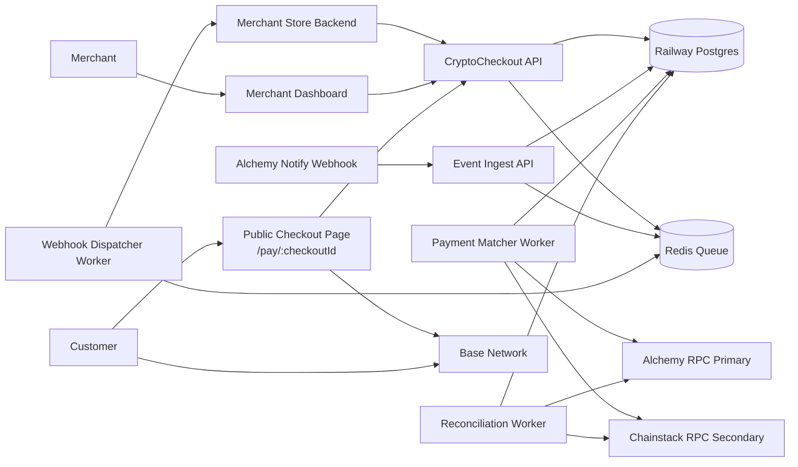
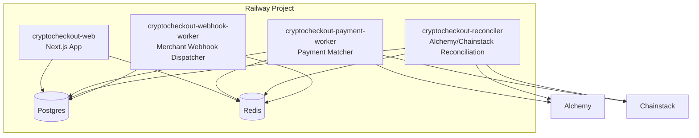
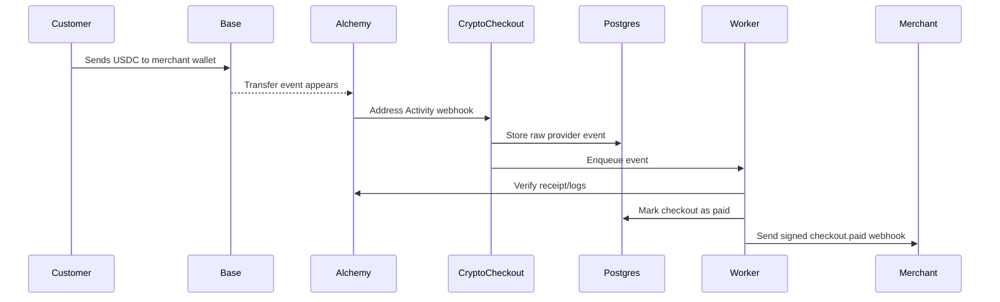
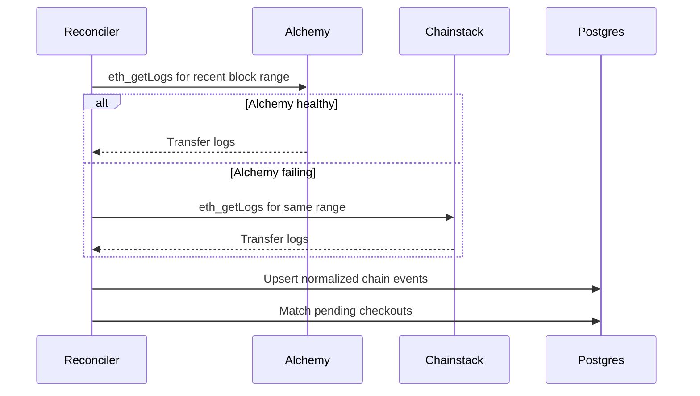
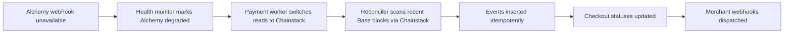
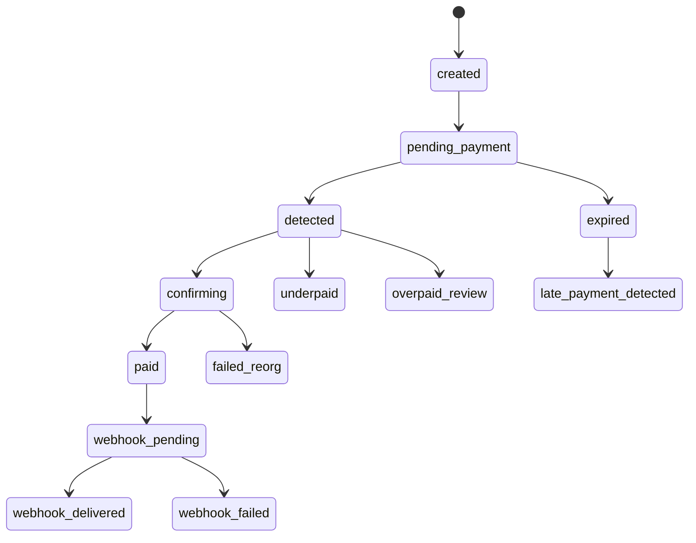
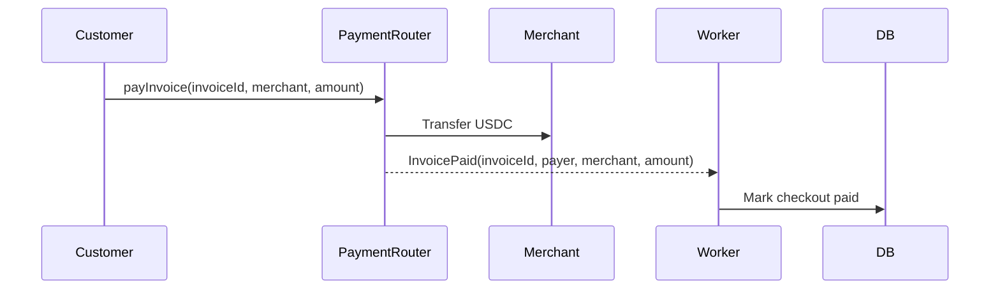

# CryptoCheckout — Full Robust Architecture

**Version:** 1.0  
**Date:** 2026-07-08  
**Primary chain provider:** Alchemy  
**Secondary/failover chain provider:** Chainstack  
**Primary chain:** Base  
**Primary token:** Native USDC on Base  
**Base USDC contract:** `0x833589fCD6eDb6E08f4C7C32D4f71b54bdA02913`  
**Settlement model:** Non-custodial direct merchant wallet settlement  
**Recommended hosting:** Railway for MVP and early production  

---

## 1. What You Are Building

CryptoCheckout is a **non-custodial stablecoin checkout platform** for ecommerce merchants.

Merchants can:

- Create USDC checkout links.
- Add their receiving wallet.
- View checkout/payment status.
- Receive signed webhooks when a checkout is paid.
- Use an API to create checkout sessions from their ecommerce backend.
- Optionally appear in a public directory of stores accepting USDC.

Customers can:

- Open a payment page.
- See the exact amount, chain, token, and recipient wallet.
- Pay USDC on Base.
- See payment status update after confirmation.

CryptoCheckout does **not** hold funds in the MVP. It verifies on-chain payments and notifies merchants.

---

## 2. Core Product Boundary

### Build Now

| Area | Description |
|---|---|
| Checkout links | Merchant creates one-time checkout links. |
| Direct wallet settlement | Customer pays USDC directly to merchant wallet. |
| Blockchain verification | Alchemy first, Chainstack second. |
| Merchant dashboard | Payments, checkouts, webhooks, API keys. |
| Signed merchant webhooks | Notify merchant backend when paid. |
| Store directory | Public discovery layer for stores accepting USDC. |
| Railway deployment | Next.js app, workers, Postgres, Redis. |

### Build Later

| Area | Description |
|---|---|
| PaymentRouter smart contract | Invoice-level on-chain events and fee splitting. |
| WooCommerce plugin | Plugin for WordPress ecommerce stores. |
| Shopify app | Only after validation; Shopify has strict app/payment rules. |
| Multi-chain support | Add Polygon, Ethereum, Solana later. |
| USDT support | Add after USDC payment flow is stable. |
| Fiat settlement | Requires more compliance and banking/payment partners. |
| Custody | Avoid unless properly licensed and legally reviewed. |

### Avoid in MVP

- Holding customer or merchant funds.
- Converting USDC to fiat.
- Acting as a money transmitter.
- Supporting too many chains.
- Supporting arbitrary tokens.
- Building a card checkout competitor.
- Relying on one RPC provider only.

---

## 3. High-Level Architecture



---

## 4. Deployment Architecture on Railway

Use one Railway project with multiple services.



### Services

| Railway Service | Runtime | Purpose | Public? |
|---|---|---|---|
| `cryptocheckout-web` | Next.js | UI, API routes, dashboard, checkout pages | Yes |
| `cryptocheckout-payment-worker` | Node/TypeScript | Processes chain events and matches payments | No |
| `cryptocheckout-reconciler` | Node/TypeScript | Periodically scans blocks/logs to recover missed events | No |
| `cryptocheckout-webhook-worker` | Node/TypeScript | Sends merchant webhooks with retries | No |
| `postgres` | Railway Postgres | Primary database | No |
| `redis` | Railway Redis | Queues, locks, rate limits, retries | No |

### Railway Networking

Use Railway private networking for service-to-service communication.

```txt
WEB -> Postgres over private DATABASE_URL
WORKERS -> Postgres over private DATABASE_URL
WEB -> Redis over private REDIS_URL
WORKERS -> Redis over private REDIS_URL
```

Only expose:

```txt
https://api.cryptocheckout.com
https://cryptocheckout.com
```

Do not publicly expose:

```txt
Postgres
Redis
Worker services
Internal health endpoints
```

---

## 5. Provider Strategy: Alchemy First, Chainstack Second

The architecture must avoid single-provider dependency. Alchemy is the primary provider because it offers strong RPC/data APIs and webhook/event ingestion. Chainstack is the secondary provider because it provides independent RPC infrastructure and Global Nodes that can be used for fallback/reconciliation.

### Provider Roles

| Role | Provider | Why |
|---|---|---|
| Primary real-time event ingestion | Alchemy Notify / Address Activity Webhooks | Fast event delivery for token transfers to tracked addresses. |
| Primary RPC reads | Alchemy RPC | Receipt checks, block reads, token log queries. |
| Secondary RPC reads | Chainstack Base RPC | Independent provider fallback. |
| Reconciliation scans | Alchemy first, Chainstack second | Ensures missed webhooks are recovered. |
| Disaster fallback | Chainstack | Continue payment verification if Alchemy has outage/rate-limit issue. |

---

## 6. Provider Flow

### Normal Mode



### Alchemy Webhook Delay or Failure



### Full Alchemy Outage



---

## 7. Why Alchemy First

Use Alchemy as primary because:

1. **Address Activity Webhooks** can notify your app when watched addresses send/receive ETH, ERC-20, ERC-721, or ERC-1155 assets.
2. It reduces your need to constantly poll the blockchain.
3. It supports webhook signing, allowing your server to verify that webhook payloads came from Alchemy.
4. It can serve both event ingestion and RPC reads.
5. It is a better first provider for fast MVP development.

Important design note: Alchemy webhooks should be treated as an **event trigger**, not as your only source of truth. Always normalize and verify important events against the chain.

---

## 8. Why Chainstack Second

Use Chainstack as secondary because:

1. It gives you independent RPC infrastructure.
2. It supports Base JSON-RPC access.
3. Global Nodes can route requests to optimized/available infrastructure.
4. It is useful for reconciliation scans and disaster fallback.
5. It protects you from primary-provider blindness.

Chainstack should not merely be an unused backup. It should be exercised continuously through low-volume health checks and scheduled reconciliation.

---

## 9. Provider Health and Failover Rules

### Health Checks

Run provider health checks every 15–30 seconds.

Check:

```txt
eth_blockNumber
eth_chainId
eth_getBlockByNumber(latest)
eth_getLogs on a tiny known-safe range
latency
error rate
timeout rate
rate-limit response rate
```

### Provider States

| State | Meaning | Action |
|---|---|---|
| `healthy` | Provider is normal | Use provider. |
| `degraded` | High latency or intermittent errors | Reduce usage, start parallel checks. |
| `rate_limited` | Too many requests | Back off and use secondary. |
| `down` | Timeouts/errors for sustained period | Fail over. |
| `recovering` | Recently restored | Gradually resume. |

### Failover Logic

```txt
1. Use Alchemy by default.
2. If Alchemy read request fails, retry once.
3. If retry fails, send read request to Chainstack.
4. If Alchemy has >5 failures in 2 minutes, mark degraded.
5. If degraded, reconciliation uses Chainstack first.
6. If Alchemy recovers for 5 consecutive health checks, return it to primary.
```

### ProviderRouter Pseudocode

```ts
/**
 * PURPOSE:
 * Route blockchain reads through Alchemy first and Chainstack second.
 *
 * INPUT:
 * RPC method name and params.
 *
 * OUTPUT:
 * RPC response from primary or secondary provider.
 *
 * CONSTRAINTS:
 * Must not mark payments paid from unverified provider data alone.
 * Must log provider latency and failures.
 */
async function callRpc(method, params) {
  try {
    return await alchemyClient.request({ method, params });
  } catch (primaryError) {
    logProviderFailure("alchemy", method, primaryError);

    try {
      return await chainstackClient.request({ method, params });
    } catch (secondaryError) {
      logProviderFailure("chainstack", method, secondaryError);
      throw new Error("All RPC providers failed");
    }
  }
}
```

---

## 10. Payment Detection Strategy

Use a **three-layer detection system**.

### Layer 1 — Alchemy Webhooks

Primary real-time event ingestion.

```txt
Alchemy Address Activity Webhook
→ /api/internal/provider-webhooks/alchemy
→ Verify Alchemy signature
→ Store raw event
→ Normalize transfer
→ Enqueue payment matching job
```

### Layer 2 — Recent Block Reconciliation

Runs every 1–2 minutes.

```txt
Scan recent blocks for USDC Transfer logs
→ Prefer Alchemy RPC
→ Fail over to Chainstack RPC
→ Upsert normalized events
→ Match unpaid checkouts
```

### Layer 3 — Deep Reconciliation

Runs every 15–60 minutes.

```txt
Rescan wider historical windows
→ Detect missed webhooks
→ Repair stuck checkouts
→ Retry failed webhook delivery
→ Generate anomaly alerts
```

### Why Three Layers?

Because payment systems must assume:

- Webhooks can be delayed.
- RPC providers can fail.
- Your worker can restart.
- Database writes can temporarily fail.
- Merchants will blame you if a payment is on-chain but your app missed it.

The system must recover automatically.

---

## 11. Payment Matching Rules

A transfer only matches a checkout if all required checks pass.

### Required Checks

| Check | Description |
|---|---|
| Chain | Must be Base mainnet. |
| Token contract | Must equal official Base USDC contract. |
| Token decimals | Use integer base units, USDC has 6 decimals. |
| Recipient | Must equal merchant receiving wallet for checkout. |
| Amount | Must equal expected amount, or satisfy configured tolerance. |
| Checkout status | Must be pending/detected/confirming, not paid/expired/cancelled. |
| Expiry | Payment block timestamp must be before expiry or within grace window. |
| Transaction uniqueness | `tx_hash + log_index` must not already be consumed. |
| Confirmations | Wait configured number of block confirmations. |
| Reorg safety | Do not mark irreversible until confirmation threshold is met. |

### Amount Handling

Always store USDC as integer units.

```txt
49.99 USDC = 49_990_000 units
```

Do not use floating point for money.

### Recommended Amount Policy

| Case | Handling |
|---|---|
| Exact amount | Mark paid after confirmations. |
| Underpaid | Mark `underpaid`; ask customer to send remaining amount or merchant manually resolves. |
| Slight overpay | Mark paid and record overpayment amount. |
| Large overpay | Mark `overpaid_review`; merchant/admin review. |
| Wrong token | Ignore as invalid; show warning in support logs. |
| Wrong chain | Ignore as invalid; show warning in support logs. |
| Late payment | Mark `late_payment_detected`; merchant decides. |

---

## 12. Checkout Status State Machine



### Status Definitions

| Status | Meaning |
|---|---|
| `created` | Checkout created but not shown/activated. |
| `pending_payment` | Waiting for customer payment. |
| `detected` | Matching transfer found but not confirmed enough. |
| `confirming` | Waiting for confirmation threshold. |
| `paid` | Payment verified and accepted. |
| `expired` | Checkout expired before payment. |
| `underpaid` | Payment amount is too small. |
| `overpaid_review` | Payment amount exceeds expected tolerance. |
| `failed_reorg` | Previously detected transaction no longer valid. |
| `late_payment_detected` | Payment arrived after expiry. |
| `webhook_pending` | Payment accepted; merchant notification queued. |
| `webhook_delivered` | Merchant successfully notified. |
| `webhook_failed` | Merchant notification failed after retries. |

---

## 13. System Components

## 13.1 Next.js Web App

### Responsibilities

- Landing page.
- Merchant dashboard.
- Public checkout page.
- Store directory.
- API routes.
- Auth.
- API key management.
- Alchemy webhook intake endpoint.
- Merchant webhook test endpoint.

### Routes

```txt
/
 /pricing
 /docs
 /stores
 /stores/:slug
 /pay/:checkoutId
 /dashboard
 /dashboard/checkouts
 /dashboard/payments
 /dashboard/webhooks
 /dashboard/developers
 /dashboard/settings
```

### API Routes

```txt
POST   /api/checkouts
GET    /api/checkouts/:id
POST   /api/wallets
GET    /api/wallets
GET    /api/payments
POST   /api/webhooks
POST   /api/webhooks/test
POST   /api/internal/provider-webhooks/alchemy
GET    /api/health
GET    /api/status/:checkoutId
```

---

## 13.2 Payment Matcher Worker

### Responsibilities

- Consume normalized chain events.
- Match USDC transfers to checkouts.
- Verify transaction receipts/logs with provider router.
- Wait for confirmations.
- Update checkout/payment statuses.
- Enqueue merchant webhook events.
- Handle duplicate events idempotently.

### Inputs

- Alchemy webhook-normalized events.
- Reconciliation-normalized events.
- Manual admin repair events.

### Outputs

- `payments` records.
- `checkout_sessions.status` updates.
- `merchant_webhook_deliveries` jobs.
- Alert events for anomalies.

---

## 13.3 Reconciliation Worker

### Responsibilities

- Scan recent Base blocks for USDC `Transfer` logs.
- Use Alchemy first.
- Use Chainstack second.
- Repair missed webhook events.
- Recheck stuck `detected` or `confirming` payments.
- Maintain block cursors.

### Scan Windows

| Type | Cadence | Window |
|---|---:|---:|
| Recent scan | Every 1–2 min | Last 100–300 blocks |
| Confirmation scan | Every 1–2 min | Pending detected transactions |
| Deep scan | Every 15–60 min | Last 2,000–10,000 blocks |
| Daily audit | Daily | Previous 24 hours |

### Cursor Strategy

Store one cursor per provider and chain.

```txt
chain_cursors
- chain
- provider
- cursor_type
- last_scanned_block
- last_success_at
- last_error_at
```

Never advance the final “safe cursor” until data is written successfully.

---

## 13.4 Webhook Dispatcher Worker

### Responsibilities

- Deliver merchant webhooks.
- Sign webhook payloads.
- Retry with exponential backoff.
- Record delivery attempts.
- Disable endpoints after repeated failures.
- Provide dashboard logs.

### Webhook Events

```txt
checkout.created
checkout.detected
checkout.paid
checkout.expired
checkout.underpaid
checkout.overpaid_review
payment.confirmed
payment.failed
```

### Webhook Headers

```txt
X-CryptoCheckout-Event: checkout.paid
X-CryptoCheckout-Timestamp: 1783520000
X-CryptoCheckout-Signature: v1=<hmac_sha256>
X-CryptoCheckout-Delivery-ID: whd_123
```

### Retry Policy

| Attempt | Delay |
|---:|---:|
| 1 | Immediately |
| 2 | 30 seconds |
| 3 | 2 minutes |
| 4 | 10 minutes |
| 5 | 30 minutes |
| 6 | 2 hours |
| 7 | 12 hours |

After final failure, mark as `failed` and show merchant a retry button.

---

## 13.5 Postgres Database

Postgres is the source of truth.

### Core Principles

- Store money as integer units.
- Use unique constraints for idempotency.
- Store raw provider payloads for auditability.
- Store normalized events separately from raw events.
- Use transactions for status changes.
- Never update payment state based on client-side data.

---

## 14. Database Schema

Below is a production-oriented schema outline. You can implement this with Prisma or Drizzle.

---

### 14.1 `users`

```sql
CREATE TABLE users (
  id UUID PRIMARY KEY DEFAULT gen_random_uuid(),
  email TEXT NOT NULL UNIQUE,
  name TEXT,
  role TEXT NOT NULL DEFAULT 'merchant',
  created_at TIMESTAMPTZ NOT NULL DEFAULT now(),
  updated_at TIMESTAMPTZ NOT NULL DEFAULT now()
);
```

---

### 14.2 `merchants`

```sql
CREATE TABLE merchants (
  id UUID PRIMARY KEY DEFAULT gen_random_uuid(),
  owner_user_id UUID NOT NULL REFERENCES users(id),
  business_name TEXT NOT NULL,
  slug TEXT NOT NULL UNIQUE,
  support_email TEXT,
  website_url TEXT,
  status TEXT NOT NULL DEFAULT 'active',
  risk_level TEXT NOT NULL DEFAULT 'normal',
  directory_enabled BOOLEAN NOT NULL DEFAULT false,
  created_at TIMESTAMPTZ NOT NULL DEFAULT now(),
  updated_at TIMESTAMPTZ NOT NULL DEFAULT now()
);
```

---

### 14.3 `merchant_wallets`

```sql
CREATE TABLE merchant_wallets (
  id UUID PRIMARY KEY DEFAULT gen_random_uuid(),
  merchant_id UUID NOT NULL REFERENCES merchants(id),
  chain TEXT NOT NULL,
  token_symbol TEXT NOT NULL,
  token_contract TEXT NOT NULL,
  wallet_address TEXT NOT NULL,
  is_primary BOOLEAN NOT NULL DEFAULT false,
  status TEXT NOT NULL DEFAULT 'active',
  created_at TIMESTAMPTZ NOT NULL DEFAULT now(),
  UNIQUE (merchant_id, chain, token_contract, wallet_address)
);

CREATE INDEX idx_merchant_wallets_lookup
ON merchant_wallets (chain, token_contract, wallet_address);
```

---

### 14.4 `api_keys`

```sql
CREATE TABLE api_keys (
  id UUID PRIMARY KEY DEFAULT gen_random_uuid(),
  merchant_id UUID NOT NULL REFERENCES merchants(id),
  key_prefix TEXT NOT NULL,
  key_hash TEXT NOT NULL UNIQUE,
  name TEXT NOT NULL,
  scopes TEXT[] NOT NULL DEFAULT ARRAY['checkouts:create', 'payments:read'],
  last_used_at TIMESTAMPTZ,
  revoked_at TIMESTAMPTZ,
  created_at TIMESTAMPTZ NOT NULL DEFAULT now()
);
```

---

### 14.5 `checkout_sessions`

```sql
CREATE TABLE checkout_sessions (
  id UUID PRIMARY KEY DEFAULT gen_random_uuid(),
  merchant_id UUID NOT NULL REFERENCES merchants(id),
  merchant_wallet_id UUID NOT NULL REFERENCES merchant_wallets(id),

  external_order_id TEXT,
  idempotency_key TEXT,

  amount_units BIGINT NOT NULL,
  currency TEXT NOT NULL DEFAULT 'USDC',
  decimals INTEGER NOT NULL DEFAULT 6,
  chain TEXT NOT NULL DEFAULT 'base',
  token_contract TEXT NOT NULL,

  status TEXT NOT NULL DEFAULT 'pending_payment',
  success_url TEXT,
  cancel_url TEXT,
  customer_email TEXT,

  metadata JSONB NOT NULL DEFAULT '{}'::jsonb,

  expires_at TIMESTAMPTZ NOT NULL,
  paid_at TIMESTAMPTZ,
  created_at TIMESTAMPTZ NOT NULL DEFAULT now(),
  updated_at TIMESTAMPTZ NOT NULL DEFAULT now(),

  UNIQUE (merchant_id, idempotency_key)
);

CREATE INDEX idx_checkout_pending_match
ON checkout_sessions (merchant_id, merchant_wallet_id, chain, token_contract, amount_units, status);

CREATE INDEX idx_checkout_status_expires
ON checkout_sessions (status, expires_at);
```

---

### 14.6 `provider_events_raw`

Stores raw payloads from Alchemy and later any other provider.

```sql
CREATE TABLE provider_events_raw (
  id UUID PRIMARY KEY DEFAULT gen_random_uuid(),
  provider TEXT NOT NULL,
  provider_event_id TEXT,
  chain TEXT NOT NULL,
  payload JSONB NOT NULL,
  signature_valid BOOLEAN NOT NULL DEFAULT false,
  received_at TIMESTAMPTZ NOT NULL DEFAULT now(),
  processed_at TIMESTAMPTZ,
  error TEXT,
  UNIQUE (provider, provider_event_id)
);
```

---

### 14.7 `chain_events`

Normalized on-chain events from webhooks or RPC scans.

```sql
CREATE TABLE chain_events (
  id UUID PRIMARY KEY DEFAULT gen_random_uuid(),

  chain TEXT NOT NULL,
  token_contract TEXT NOT NULL,
  event_name TEXT NOT NULL,

  tx_hash TEXT NOT NULL,
  log_index INTEGER NOT NULL,
  block_number BIGINT NOT NULL,
  block_hash TEXT,
  from_address TEXT,
  to_address TEXT,
  amount_units BIGINT,

  source_provider TEXT NOT NULL,
  raw_event_id UUID REFERENCES provider_events_raw(id),

  confirmation_status TEXT NOT NULL DEFAULT 'unconfirmed',
  matched_checkout_id UUID REFERENCES checkout_sessions(id),
  consumed_at TIMESTAMPTZ,

  created_at TIMESTAMPTZ NOT NULL DEFAULT now(),

  UNIQUE (chain, tx_hash, log_index)
);

CREATE INDEX idx_chain_events_match
ON chain_events (chain, token_contract, to_address, amount_units, confirmation_status);

CREATE INDEX idx_chain_events_block
ON chain_events (chain, block_number);
```

---

### 14.8 `payments`

```sql
CREATE TABLE payments (
  id UUID PRIMARY KEY DEFAULT gen_random_uuid(),

  checkout_session_id UUID NOT NULL REFERENCES checkout_sessions(id),
  merchant_id UUID NOT NULL REFERENCES merchants(id),
  chain_event_id UUID REFERENCES chain_events(id),

  chain TEXT NOT NULL,
  token_symbol TEXT NOT NULL,
  token_contract TEXT NOT NULL,

  tx_hash TEXT NOT NULL,
  log_index INTEGER NOT NULL,
  block_number BIGINT NOT NULL,

  from_address TEXT,
  to_address TEXT NOT NULL,
  amount_units BIGINT NOT NULL,
  expected_amount_units BIGINT NOT NULL,

  status TEXT NOT NULL DEFAULT 'confirmed',
  provider_verified_by TEXT,
  confirmed_at TIMESTAMPTZ,

  created_at TIMESTAMPTZ NOT NULL DEFAULT now(),

  UNIQUE (chain, tx_hash, log_index),
  UNIQUE (checkout_session_id)
);

CREATE INDEX idx_payments_merchant_created
ON payments (merchant_id, created_at DESC);
```

---

### 14.9 `merchant_webhook_endpoints`

```sql
CREATE TABLE merchant_webhook_endpoints (
  id UUID PRIMARY KEY DEFAULT gen_random_uuid(),
  merchant_id UUID NOT NULL REFERENCES merchants(id),
  url TEXT NOT NULL,
  signing_secret_hash TEXT NOT NULL,
  events TEXT[] NOT NULL DEFAULT ARRAY['checkout.paid'],
  status TEXT NOT NULL DEFAULT 'active',
  failure_count INTEGER NOT NULL DEFAULT 0,
  last_success_at TIMESTAMPTZ,
  last_failure_at TIMESTAMPTZ,
  created_at TIMESTAMPTZ NOT NULL DEFAULT now()
);
```

---

### 14.10 `merchant_webhook_deliveries`

```sql
CREATE TABLE merchant_webhook_deliveries (
  id UUID PRIMARY KEY DEFAULT gen_random_uuid(),
  merchant_id UUID NOT NULL REFERENCES merchants(id),
  webhook_endpoint_id UUID NOT NULL REFERENCES merchant_webhook_endpoints(id),
  checkout_session_id UUID REFERENCES checkout_sessions(id),
  payment_id UUID REFERENCES payments(id),

  event_type TEXT NOT NULL,
  payload JSONB NOT NULL,

  status TEXT NOT NULL DEFAULT 'pending',
  attempt_count INTEGER NOT NULL DEFAULT 0,
  next_attempt_at TIMESTAMPTZ NOT NULL DEFAULT now(),

  last_response_status INTEGER,
  last_response_body TEXT,
  last_error TEXT,

  created_at TIMESTAMPTZ NOT NULL DEFAULT now(),
  delivered_at TIMESTAMPTZ
);

CREATE INDEX idx_webhook_deliveries_due
ON merchant_webhook_deliveries (status, next_attempt_at);
```

---

### 14.11 `provider_health_checks`

```sql
CREATE TABLE provider_health_checks (
  id UUID PRIMARY KEY DEFAULT gen_random_uuid(),
  provider TEXT NOT NULL,
  chain TEXT NOT NULL,
  status TEXT NOT NULL,
  latency_ms INTEGER,
  block_number BIGINT,
  error TEXT,
  checked_at TIMESTAMPTZ NOT NULL DEFAULT now()
);

CREATE INDEX idx_provider_health_recent
ON provider_health_checks (provider, chain, checked_at DESC);
```

---

### 14.12 `chain_cursors`

```sql
CREATE TABLE chain_cursors (
  id UUID PRIMARY KEY DEFAULT gen_random_uuid(),
  chain TEXT NOT NULL,
  provider TEXT NOT NULL,
  cursor_type TEXT NOT NULL,
  last_scanned_block BIGINT NOT NULL,
  last_success_at TIMESTAMPTZ,
  last_error_at TIMESTAMPTZ,
  updated_at TIMESTAMPTZ NOT NULL DEFAULT now(),
  UNIQUE (chain, provider, cursor_type)
);
```

---

## 15. Redis Queues

Use Redis-backed queues with BullMQ or similar.

### Queues

| Queue | Purpose |
|---|---|
| `chain-events` | Normalize and process incoming on-chain events. |
| `payment-matching` | Match transfers to pending checkouts. |
| `confirmations` | Recheck pending detected payments. |
| `merchant-webhooks` | Deliver merchant webhooks. |
| `reconciliation` | Scan block ranges for missed events. |
| `alerts` | Notify admin of anomalies/outages. |

### Job Idempotency

Use stable job IDs, joined with `|`, not `:`. BullMQ rejects any custom job
ID containing `:` unless it splits into exactly 3 parts (compatibility check
for its own repeatable-job ID format) — every colon-joined, multi-field ID
below used to violate that silently until it was actually exercised in
production.

```txt
chain-event|base|<tx_hash>|<log_index>
payment-match|<checkout_id>
webhook-delivery|<delivery_id>|<attempt>
reconcile|base|<from_block>|<to_block>
```

---

## 16. API Design

## 16.1 Create Checkout

### Endpoint

```txt
POST /api/checkouts
```

### Headers

```txt
Authorization: Bearer ck_live_xxx
Idempotency-Key: order_12345
```

### Request

```json
{
  "amount": "49.99",
  "currency": "USDC",
  "chain": "base",
  "successUrl": "https://merchant.com/success",
  "cancelUrl": "https://merchant.com/cancel",
  "customerEmail": "customer@example.com",
  "metadata": {
    "orderId": "ORD-12345",
    "cartId": "CART-888"
  }
}
```

### Response

```json
{
  "id": "chk_01J...",
  "status": "pending_payment",
  "amount": "49.99",
  "currency": "USDC",
  "chain": "base",
  "paymentUrl": "https://cryptocheckout.com/pay/chk_01J...",
  "expiresAt": "2026-07-08T13:30:00Z",
  "recipient": {
    "address": "0xMerchantWallet...",
    "tokenContract": "0x833589fCD6eDb6E08f4C7C32D4f71b54bdA02913"
  }
}
```

---

## 16.2 Get Checkout

```txt
GET /api/checkouts/:id
```

Returns checkout status, payment details, and expiry.

---

## 16.3 Payment Status Polling

```txt
GET /api/status/:checkoutId
```

Used by the checkout page.

Recommended polling:

```txt
Every 3 seconds for first 60 seconds
Every 8 seconds after 60 seconds
Stop after expiry + grace window
Use SSE/WebSocket later if needed
```

---

## 16.4 Alchemy Webhook Intake

```txt
POST /api/internal/provider-webhooks/alchemy
```

Rules:

1. Verify Alchemy signature.
2. Store raw payload.
3. Return `200` quickly.
4. Process async through queue.
5. Never do heavy matching inside the HTTP request.

---

## 16.5 Merchant Webhook Payload

```json
{
  "id": "evt_01J...",
  "type": "checkout.paid",
  "createdAt": "2026-07-08T13:01:00Z",
  "data": {
    "checkoutId": "chk_01J...",
    "paymentId": "pay_01J...",
    "amount": "49.99",
    "amountUnits": "49990000",
    "currency": "USDC",
    "chain": "base",
    "txHash": "0x...",
    "fromAddress": "0xCustomer...",
    "toAddress": "0xMerchant...",
    "metadata": {
      "orderId": "ORD-12345"
    }
  }
}
```

---

## 17. Checkout Page UX

The public checkout page should show:

```txt
Merchant name
Amount due
Currency: USDC
Network: Base
Recipient wallet
QR code
Copy address button
Pay with wallet button
Timer until expiry
Payment status
Warning: only send native USDC on Base
```

### Payment Page States

| State | UI Text |
|---|---|
| Pending | Waiting for payment |
| Detected | Payment detected, confirming |
| Paid | Payment confirmed |
| Expired | Checkout expired |
| Underpaid | Payment was received but amount is too low |
| Wrong token | Unsupported token detected |
| Late payment | Payment arrived after checkout expired |

---

## 18. Security Architecture

## 18.1 API Security

- Hash API keys before storing.
- Show full API key only once.
- Use prefix for identification.
- Apply per-merchant rate limits.
- Support key revocation.
- Scope keys by permission.

### API Key Format

```txt
ck_test_<prefix>_<secret>
ck_live_<prefix>_<secret>
```

---

## 18.2 Webhook Security

### Incoming Alchemy Webhook

- Verify Alchemy signature.
- Reject invalid signatures.
- Store invalid attempts for security logs.
- Rate-limit endpoint.
- Return fast.

### Outgoing Merchant Webhook

- Sign with HMAC SHA-256.
- Include timestamp.
- Reject replay on merchant side.
- Provide documentation for verification.
- Retry safely.

---

## 18.3 Database Security

- Use SSL connections.
- Use private Railway networking.
- Do not expose Postgres publicly.
- Encrypt secrets at application layer if needed.
- Store webhook signing secret hash; store decryptable secret only if necessary for signing, preferably via encrypted secrets store.
- Restrict production DB access.
- Enable backups.

---

## 18.4 Payment Security

- Never trust client-provided payment status.
- Never trust unverified webhooks alone.
- Verify token contract address.
- Verify recipient address.
- Verify amount in integer units.
- Verify transaction receipt/log.
- Use unique constraints on transaction hash and log index.
- Use confirmation threshold.
- Keep audit trail of raw provider events.

---

## 19. Observability

## 19.1 Metrics

Track:

```txt
checkouts_created_total
payments_detected_total
payments_confirmed_total
payments_underpaid_total
payments_late_total
alchemy_webhook_latency_ms
alchemy_rpc_latency_ms
chainstack_rpc_latency_ms
provider_failover_count
webhook_delivery_success_rate
webhook_delivery_failure_count
checkout_payment_time_seconds
reconciliation_events_found_total
missed_webhook_recovered_total
```

## 19.2 Logs

Structured logs should include:

```txt
request_id
merchant_id
checkout_id
payment_id
provider
chain
tx_hash
log_index
block_number
status
error_code
```

## 19.3 Alerts

Alert on:

| Alert | Threshold |
|---|---|
| Alchemy webhook silence | No webhook events for suspiciously long period during active volume |
| Alchemy RPC degraded | Error rate > 5% for 5 minutes |
| Chainstack fallback degraded | Error rate > 5% for 5 minutes |
| Reconciliation found missed payments | Any missed paid checkout recovered |
| Webhook failure spike | Delivery success < 95% |
| DB connection saturation | >80% connection usage |
| Queue backlog | Jobs older than 5 minutes |
| Payment stuck confirming | >10 minutes |
| Duplicate event conflict | Any unexpected conflict pattern |

---

## 20. Scaling Plan

## 20.1 MVP Scale

Target:

```txt
0–10,000 paid checkouts/month
```

Railway Hobby can be enough if traffic is modest.

Suggested services:

```txt
1x Next.js web
1x payment worker
1x Postgres
Optional Redis
```

---

## 20.2 Beta Scale

Target:

```txt
10,000–100,000 paid checkouts/month
```

Architecture:

```txt
1–2x Next.js web replicas
1x payment worker
1x reconciliation worker
1x webhook worker
Postgres
Redis
Alchemy primary
Chainstack secondary
```

---

## 20.3 Early Production Scale

Target:

```txt
100,000–1,000,000 paid checkouts/month
```

Architecture:

```txt
2–4x Next.js web replicas
2x payment workers
1–2x reconciliation workers
2–4x webhook workers
Managed Postgres with backups
Redis queue
Provider health monitor
Admin alerting
```

At 1,000,000 paid checkouts/month:

```txt
1,000,000 / 30 days = 33,333/day
33,333 / 24 hours = 1,389/hour
1,389 / 60 minutes = 23/minute
23 / 60 seconds = 0.39/second average
```

The average throughput is not hard. The hard parts are reliability, spikes, webhook retries, provider failure, and auditability.

---

## 21. Address Tracking Strategy

Alchemy Address Activity Webhooks can track address activity for watched addresses. For a direct-wallet settlement model, every merchant wallet you support should be registered for monitoring.

### Stage 1

One merchant wallet per merchant.

```txt
merchant_wallets.wallet_address
→ Add to Alchemy Address Activity Webhook
```

### Stage 2

If you exceed provider address limits:

```txt
Shard tracked merchant addresses across multiple Alchemy webhooks.
Maintain webhook_shards table.
Assign merchant_wallet_id to shard.
```

### Stage 3

Move to smart contract PaymentRouter.

With a PaymentRouter:

```txt
All payments go through one contract.
Alchemy watches one contract address/event.
Payment matching becomes invoiceId-based.
```

This is much cleaner at scale.

---

## 22. Recommended Evolution: Direct Wallet to PaymentRouter

## 22.1 MVP: Direct Wallet Settlement

Pros:

- Fast to build.
- No Solidity risk.
- Non-custodial.
- Easy to explain.

Cons:

- Payment matching can be ambiguous if two pending invoices have same amount.
- Harder to collect platform fee automatically.
- Requires tracking many merchant wallet addresses.

---

## 22.2 Production: PaymentRouter Smart Contract

PaymentRouter flow:



### Benefits

- Event includes invoice ID.
- No ambiguous amount matching.
- Can split platform fee.
- Can support refunds later.
- Can track one contract instead of many wallets.

### Risks

- Requires smart contract development.
- Requires tests.
- Requires security review.
- Contract bugs can be expensive.

---

## 23. Provider-Aware Event Normalization

Normalize every incoming provider payload into one internal shape.

```ts
type NormalizedChainEvent = {
  chain: "base";
  provider: "alchemy" | "chainstack";
  eventName: "Transfer";
  tokenContract: string;
  txHash: string;
  logIndex: number;
  blockNumber: bigint;
  blockHash?: string;
  fromAddress: string;
  toAddress: string;
  amountUnits: bigint;
};
```

This lets Alchemy webhooks and Chainstack scans feed the same payment matching pipeline.

---

## 24. Idempotency Rules

Idempotency is mandatory.

### Unique Keys

| Resource | Unique Key |
|---|---|
| Checkout creation | `merchant_id + idempotency_key` |
| Raw provider event | `provider + provider_event_id` |
| Chain event | `chain + tx_hash + log_index` |
| Payment | `chain + tx_hash + log_index` and `checkout_session_id` |
| Webhook delivery | `delivery_id` |

### Why

Without idempotency:

- A duplicate webhook can mark two checkouts paid.
- A retry can send duplicate merchant notifications.
- A reconciliation scan can duplicate a payment.
- A worker restart can double-process jobs.

Payment systems do not forgive “oops.”

---

## 25. Environment Variables

```env
# App
APP_BASE_URL=https://cryptocheckout.com
NODE_ENV=production

# Database
DATABASE_URL=postgresql://...

# Redis
REDIS_URL=redis://...

# Auth
AUTH_SECRET=...
AUTH_PROVIDER_SECRET=...

# Chain
PRIMARY_CHAIN=base
BASE_CHAIN_ID=8453
BASE_USDC_ADDRESS=0x833589fCD6eDb6E08f4C7C32D4f71b54bdA02913
USDC_DECIMALS=6
CONFIRMATIONS_REQUIRED=3

# Alchemy Primary
ALCHEMY_BASE_RPC_URL=https://base-mainnet.g.alchemy.com/v2/...
ALCHEMY_WEBHOOK_SIGNING_KEY=...
ALCHEMY_NOTIFY_WEBHOOK_ID=...

# Chainstack Secondary
CHAINSTACK_BASE_RPC_URL=https://base-mainnet.core.chainstack.com/...

# Provider behavior
RPC_PRIMARY_PROVIDER=alchemy
RPC_SECONDARY_PROVIDER=chainstack
RPC_TIMEOUT_MS=8000
RPC_FAILOVER_ENABLED=true
RPC_HEALTH_CHECK_INTERVAL_SECONDS=30

# Webhook signing
MERCHANT_WEBHOOK_SECRET_ENCRYPTION_KEY=...

# Rate limits
API_RATE_LIMIT_PER_MINUTE=120
CHECKOUT_STATUS_RATE_LIMIT_PER_MINUTE=60
```

---

## 26. Folder Structure

```txt
cryptocheckout/
├── app/
│   ├── page.tsx
│   ├── pricing/
│   ├── docs/
│   ├── stores/
│   ├── pay/
│   │   └── [checkoutId]/
│   ├── dashboard/
│   │   ├── checkouts/
│   │   ├── payments/
│   │   ├── webhooks/
│   │   ├── developers/
│   │   └── settings/
│   └── api/
│       ├── checkouts/
│       ├── wallets/
│       ├── payments/
│       ├── webhooks/
│       ├── status/
│       └── internal/
│           └── provider-webhooks/
│               └── alchemy/
├── components/
│   ├── dashboard/
│   ├── checkout/
│   ├── ui/
│   └── marketing/
├── lib/
│   ├── auth/
│   ├── db/
│   ├── providers/
│   │   ├── alchemy.ts
│   │   ├── chainstack.ts
│   │   ├── provider-router.ts
│   │   └── health.ts
│   ├── payments/
│   │   ├── match-payment.ts
│   │   ├── normalize-event.ts
│   │   ├── status-machine.ts
│   │   └── usdc.ts
│   ├── webhooks/
│   │   ├── sign.ts
│   │   ├── dispatch.ts
│   │   └── verify-alchemy.ts
│   ├── queues/
│   └── security/
├── workers/
│   ├── payment-listener.ts
│   ├── reconciler.ts
│   ├── webhook-dispatcher.ts
│   └── provider-health.ts
├── prisma/
│   └── schema.prisma
├── scripts/
│   ├── add-alchemy-address.ts
│   ├── backfill-events.ts
│   └── verify-provider-health.ts
└── package.json
```

---

## 27. Package Scripts

```json
{
  "scripts": {
    "dev": "next dev",
    "build": "next build",
    "start": "next start",
    "worker:payments": "tsx workers/payment-listener.ts",
    "worker:reconciler": "tsx workers/reconciler.ts",
    "worker:webhooks": "tsx workers/webhook-dispatcher.ts",
    "worker:health": "tsx workers/provider-health.ts",
    "db:migrate": "prisma migrate deploy",
    "db:studio": "prisma studio"
  }
}
```

---

## 28. Railway Service Commands

| Service | Start Command |
|---|---|
| Web | `pnpm start` |
| Payment Worker | `pnpm worker:payments` |
| Reconciler | `pnpm worker:reconciler` |
| Webhook Worker | `pnpm worker:webhooks` |
| Provider Health | `pnpm worker:health` |

For MVP, you can combine workers:

```txt
payment-listener + reconciler + webhook-dispatcher
```

For production, split them.

---

## 29. Merchant API Rate Limits

| Endpoint | Limit |
|---|---:|
| Create checkout | 60/min/merchant |
| Get checkout | 300/min/merchant |
| List payments | 120/min/merchant |
| Status polling | 60/min/IP/checkout |
| Webhook test | 10/min/merchant |
| API key creation | 5/hour/merchant |

---

## 30. Admin Dashboard

Admin-only pages:

```txt
/admin/merchants
/admin/checkouts
/admin/payments
/admin/provider-health
/admin/webhook-failures
/admin/reconciliation
/admin/risk
```

Admin features:

- Search by transaction hash.
- Search by checkout ID.
- Force reconciliation on block range.
- Retry merchant webhook.
- Mark late payment accepted.
- Disable suspicious merchant.
- View provider health.
- View duplicate/conflict events.

---

## 31. Error Handling Playbook

| Scenario | System Response |
|---|---|
| Alchemy webhook duplicate | Upsert raw event; ignore duplicate chain event. |
| Chainstack finds already-seen event | Ignore due to `chain + tx_hash + log_index`. |
| Customer underpays | Mark underpaid; notify merchant optionally. |
| Customer overpays | Mark paid if within tolerance, otherwise review. |
| Customer pays wrong token | Do not match; show support warning. |
| Customer pays wrong chain | Do not match; show support warning. |
| Payment after expiry | Mark late payment; merchant review. |
| Merchant webhook fails | Retry with backoff. |
| Provider outage | Fail over to secondary. |
| Worker crash | Queue retries and reconciliation recover. |
| DB write failure | Do not acknowledge processing; retry job. |
| Reorg detected | Move payment to `failed_reorg` and alert. |

---

## 32. Compliance Positioning

MVP wording:

```txt
CryptoCheckout is a non-custodial checkout and payment verification tool.
Funds move directly from customer wallets to merchant wallets.
CryptoCheckout does not hold, custody, convert, or settle customer funds.
```

Avoid saying:

```txt
We process funds.
We custody crypto.
We settle merchant balances.
We convert stablecoins to fiat.
We are a money transmitter.
```

Production checklist before real scale:

- Talk to fintech/crypto legal counsel.
- Add merchant terms of service.
- Add prohibited businesses policy.
- Add sanctions screening if needed.
- Add transaction monitoring if required.
- Add merchant KYB if business model requires it.
- Add privacy policy and data retention policy.

---

## 33. Development Roadmap

## Phase 1 — MVP Foundation

Duration: 1–2 weeks

Build:

- Next.js app.
- Merchant auth.
- Railway Postgres.
- Merchant wallet setup.
- Checkout creation.
- Public checkout page.
- Manual status polling.
- Basic dashboard.

---

## Phase 2 — Alchemy Primary Integration

Duration: 1 week

Build:

- Alchemy webhook endpoint.
- Signature verification.
- Raw event storage.
- Normalized chain event model.
- Payment matching worker.
- Checkout paid status.
- Merchant webhook dispatch.

---

## Phase 3 — Chainstack Secondary Integration

Duration: 1 week

Build:

- Chainstack RPC client.
- ProviderRouter.
- Provider health checks.
- RPC failover.
- Recent block reconciliation.
- Cursor persistence.
- Provider observability dashboard.

---

## Phase 4 — Reliability Hardening

Duration: 1–2 weeks

Build:

- Deep reconciliation.
- Webhook retry queue.
- Admin dashboard.
- Alerting.
- Idempotency everywhere.
- Underpay/overpay handling.
- Payment audit logs.

---

## Phase 5 — Growth Features

Duration: after validation

Build:

- Store directory.
- Public merchant profiles.
- WooCommerce plugin.
- API documentation portal.
- PaymentRouter smart contract.
- Platform fee splitting.
- Multi-chain support.

---

## 34. Final Architecture Summary

You are building:

```txt
A non-custodial USDC checkout platform for ecommerce merchants.
```

Your robust production-style architecture is:

```txt
Next.js app on Railway
+ Railway Postgres
+ Railway Redis
+ Payment worker
+ Reconciliation worker
+ Webhook worker
+ Alchemy as primary event/RPC provider
+ Chainstack as secondary RPC/reconciliation provider
+ Direct merchant wallet settlement
+ Signed merchant webhooks
+ Store discovery directory
```

The most important engineering rule:

```txt
Alchemy triggers events.
Chainstack verifies resilience.
Postgres decides truth.
Workers repair failure.
Webhooks notify merchants.
CryptoCheckout never holds funds in the MVP.
```

---

## 35. Source Notes

The architecture uses the following current official documentation and provider facts checked on 2026-07-08:

- Alchemy Address Activity Webhooks track address activity including ETH, ERC-20, ERC-721, and ERC-1155 transfers, and Alchemy documents webhook signing using HMAC SHA-256.
- Alchemy webhook docs mention support for adding large address sets to Address Activity webhooks.
- Chainstack documents Global Nodes as load-balanced node endpoints that route requests to optimized locations.
- Chainstack documents Base JSON-RPC API access.
- Circle documents official USDC contract addresses, including USDC on Base.
- Railway documents zero-configuration PostgreSQL provisioning and recommends private networking for internal service communication.

For implementation, verify exact provider limits and pricing inside your own Alchemy, Chainstack, and Railway dashboards before production launch.
